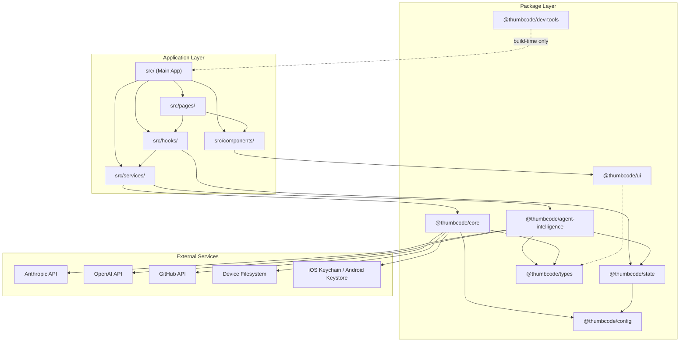
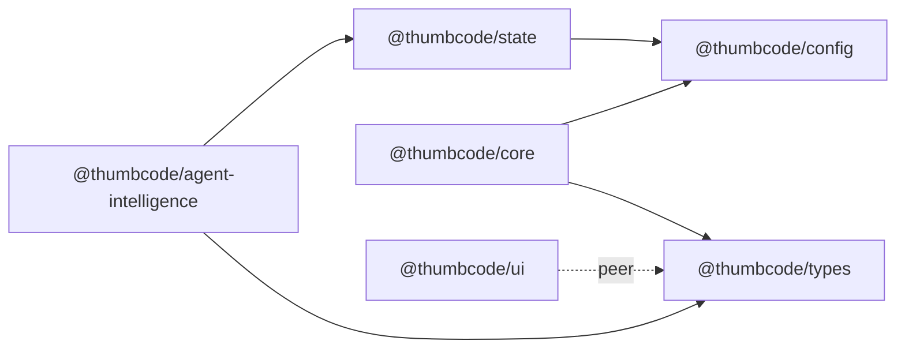

# ThumbCode System Patterns

> Last Updated: February 2026

## Architecture Overview

ThumbCode is a **pnpm monorepo** with a React 18 web application wrapped in Capacitor 8 for native iOS/Android deployment. The codebase is split between a main application (`src/`) and shared workspace packages (`packages/`).



## Package Dependency Graph



### Package Responsibilities

| Package | Purpose | Key Exports |
|---------|---------|-------------|
| **@thumbcode/types** | Shared TypeScript type definitions | Agent, Project, Chat, Credential, Workspace types |
| **@thumbcode/config** | Environment config, feature flags, constants | `env`, `constants`, `features` |
| **@thumbcode/state** | Zustand stores for global state | `agentStore`, `chatStore`, `credentialStore`, `projectStore`, `userStore` |
| **@thumbcode/core** | Git operations, credential management | `GitService`, `CredentialService`, isomorphic-git wrapper |
| **@thumbcode/agent-intelligence** | AI clients, agent logic, orchestrator | Anthropic/OpenAI clients, `AgentOrchestrator`, tool calling, token tracking |
| **@thumbcode/ui** | Design system components | Primitives (Box, Text, Button, Card), Layout, Form, Feedback, Theme |
| **@thumbcode/dev-tools** | Build-time tooling (not runtime) | Token generator, icon generator |

## Data Flow Patterns

### 1. User Message to Agent Response

```
User types message
  -> ChatInput component
  -> useSendMessage hook
  -> chatStore.addMessage()
  -> AgentResponseService
  -> @thumbcode/agent-intelligence AI client
  -> Anthropic/OpenAI API (streaming)
  -> chatStore.appendStreamChunk()
  -> ChatMessage component re-renders progressively
```

### 2. Credential Storage Flow

```
User enters API key
  -> CredentialSettings page
  -> useCredentials hook
  -> @thumbcode/core CredentialService
  -> Validation (test API call)
  -> capacitor-secure-storage-plugin (Keychain/Keystore)
  -> credentialStore updated
  -> UI reflects authenticated state
```

### 3. Git Operations Flow

```
User triggers git action (clone, commit, push)
  -> useProjectFiles / useProjectActions hook
  -> @thumbcode/core GitService
  -> isomorphic-git operations
  -> @capacitor/filesystem for local storage
  -> projectStore updated
  -> UI reflects repo state
```

### 4. Multi-Agent Orchestration Flow (Target Architecture)

```
User request -> AgentOrchestrator
  -> Task decomposition
  -> Architect agent (plan, types)
  -> User approval checkpoint
  -> Implementer agent (code)
  -> Reviewer agent (audit)
  -> Tester agent (tests)
  -> User final approval
  -> Git commit via core
```

**Current state**: The orchestrator exists in `@thumbcode/agent-intelligence` but is not yet wired to real execution. Single-agent routing through the orchestrator is the next milestone (US-003).

## State Architecture (Zustand 5)

### Store Relationships

```
userStore (credentials, preferences, onboarding state)
  |
  v
projectStore (repos, branches, git state) --> workspaceStore (files, changes)
  |
  v
agentStore (agent instances, status, metrics) <-> chatStore (threads, messages, streaming)
```

### Store Design Pattern

All stores follow the slice-based pattern with actions and selectors:

```typescript
interface StorePattern<T> {
  // State
  data: T;
  loading: boolean;
  error: Error | null;

  // Actions
  fetch: () => Promise<void>;
  update: (partial: Partial<T>) => void;
  reset: () => void;
}
```

Stores are consumed via hooks (e.g., `useAgentList`, `useProjectList`, `useHomeDashboard`) that encapsulate store subscriptions and derived state. Pages are thin composition layers that import hooks and components.

## Routing Architecture

React Router DOM 7 with client-side routing:

| Route Group | Path | Purpose |
|-------------|------|---------|
| Onboarding | `/onboarding/*` | Welcome, GitHub auth, API keys, first project |
| Tabs | `/` (home), `/projects`, `/agents`, `/chat`, `/settings` | Main navigation |
| Detail | `/project/:id`, `/agent/:id` | Entity detail pages |
| Settings | `/settings/credentials`, `/settings/agents`, `/settings/editor` | Settings sub-pages |

Layout structure: `RootLayout` wraps all routes with theme, error boundaries, and auth guards.

## Security Architecture

- **Credential storage**: `capacitor-secure-storage-plugin` backed by iOS Keychain / Android Keystore
- **GitHub auth**: Device Flow (OAuth 2.0 Device Authorization Grant) -- no embedded browser
- **API key validation**: Live test call before storage
- **No server dependency**: All operations client-side, credentials never leave device
- **Biometric unlock**: Optional via `@aparajita/capacitor-biometric-auth`

## Build Pipeline

```
Source (src/ + packages/) -> Vite 7 Build -> dist/ -> Capacitor Sync -> iOS/Android
                                                   -> Web deploy (Netlify)
```

CI/CD: GitHub Actions runs lint -> typecheck -> test -> build on every push. SonarCloud for static analysis.

## Component Architecture

### Design System Layers

1. **@thumbcode/ui** -- canonical primitives (Box, Text, Button, Card, Input, Switch, Spinner, Alert, etc.)
2. **src/components/ui/** -- re-exports from @thumbcode/ui (thin wrappers for app-level use)
3. **src/components/{agents,chat,project,workspace}/** -- domain-specific composed components
4. **src/pages/** -- page-level composition (thin, hooks + components)

### Organic Styling Convention

All components use the P3 "Warm Technical" design system with organic paint daub aesthetics:

- Asymmetric border-radius via Tailwind classes (`rounded-organic-card`, `rounded-organic-button`)
- Multi-layered shadows with brand color tints
- Subtle rotation transforms on cards
- **No gradients** -- textured, imperfect shapes

Tailwind CSS is the only styling approach. The earlier dual approach (JS objects + Tailwind) is being consolidated to Tailwind-only (US-013).

## Testing Strategy

| Layer | Tool | Location |
|-------|------|----------|
| Unit tests | Vitest + Testing Library | `src/**/*.test.ts(x)`, `packages/**/*.test.ts` |
| E2E tests | Playwright | `e2e/*.spec.ts` |
| Type checking | TypeScript `tsc --noEmit` | All `tsconfig.json` |
| Linting | Biome | `biome.json` (covers all packages) |
| Static analysis | SonarCloud | `sonar-project.properties` |

Current metrics: 85 test files, 950 tests passing, ~35% statement coverage (target: 80%).
